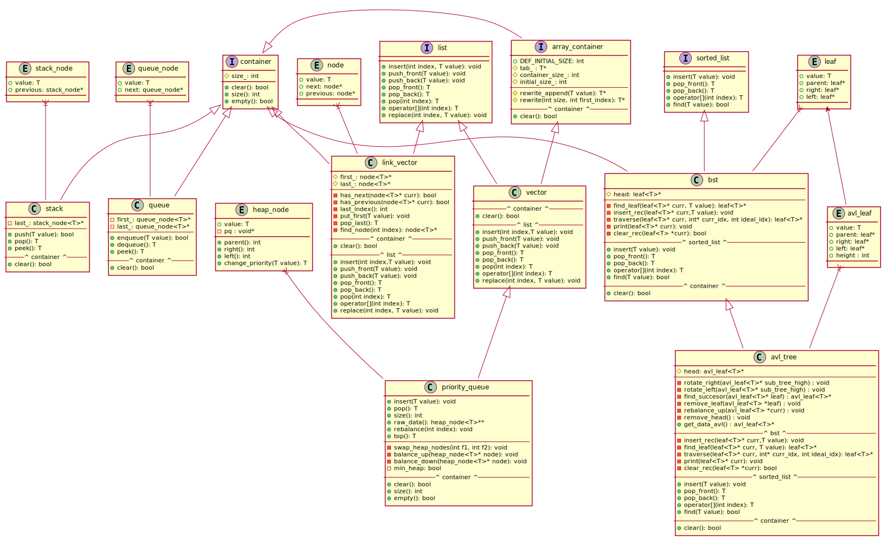

# Summary

 Members                        | Descriptions                                
--------------------------------|---------------------------------------------
`namespace `[`utils`](#namespaceutils) | namespace with things that doesnt fit in class
`class `[`array_container`](#class-array_container) | Interface for structures which uses arrays as base.
`class `[`avl_leaf`](#class-avl_leaf) | Tree leaf that is used in avl tree In addition it has height
`class `[`avl_tree`](#class-avl_tree) | Self Balancing Binary Search Tree with [sorted_list](#class-sorted_list) interface. It's using node like objects.
`class `[`bst`](#class-bst) | Binary Search Tree with [sorted_list](#class-sorted_list) interface. It's using node like objects.
`class `[`container`](#class-container) | Basic interface with basic info as size in it, used in all structures.
`class `[`heap_node`](#classheap__node) | Element which is used in priority_queue->vector as element 
`class `[`leaf`](#class-leaf) | Tree leaf that is used in binary tree such as bst.
`class `[`link_vector`](#class-link_vector) | A class that forms a 2-way linked list using [. ](#struct-node)
`class `[`list`](#class-list) | Interface for on-list operation with pure virtual methods and protected constructor and destructor
`class `[`priority_queue`](#class-priority_queue) | Priority queue based on heap which is based on vector which holds heap_node<T>* Values don't need to be unique. If no min_heap value is passed to constructor it's made to be min heap 
`class `[`queue`](#class-queue) | Basic LIFO structure that uses [queue_node](#struct-queue_node)
`class `[`sorted_list`](#class-sorted_list) | Only reliable on sorted structures. Interface for on-list operation with pure virtual methods and protected constructor and destructor.
`class `[`stack`](#class-stack) | Basic FIFO structure Uses [stack_node](#struct-stack_node) (one way node)
`class `[`vector`](#class-vector) | Resizeable array.
`struct `[`node`](#struct-node) | It's 2 way linked list. Stores: value, next node, previous node
`struct `[`queue_node`](#struct-queue_node) | Used only in queue as a (one) element container.
`struct `[`stack_node`](#struct-stack_node) | Used only in stack as a (one) element container.



# namespace `utils` 

namespace with things that doesnt fit in class

## Summary

 Members                        | Descriptions                                
--------------------------------|---------------------------------------------
`public template<>`  <br/>`int `[`get_height`](#namespaceutils_1aa19189f1cc7dcbefc37d8e0ddc327b04)`(`[`avl_leaf`](#class-avl_leaf)`< T > * node)`            | Gets height of leaf, if is not present returns 0 
`public template<>`  <br/>`int `[`calc_balance`](#namespaceutils_1abce3e9362c279c936f67b98b4c3aaf05)`(`[`avl_leaf`](#class-avl_leaf)`< T > * node)`            | Calculate balance value in node for self balancing avl. If node if nullptr returns 0.
`public template<>`  <br/>`void `[`update_height`](#namespaceutils_1a33f7ed1c5b5da579369bbcc7cee3d686)`(`[`avl_leaf`](#class-avl_leaf)`< T > * node)`            | Updates heights based on subtrees below. It needs to be run with <T> at end. 
`public template<>`  <br/>`void `[`swap_avl_node`](#namespaceutils_1ab90f95826b1ae92c9ec5c8d07d14b375)`(`[`avl_leaf`](#class-avl_leaf)`< T > * f1,`[`avl_leaf`](#class-avl_leaf)`< T > * f2)`            | Swaps two elements' values in avl tree 
`public template<>`  <br/>`T `[`max`](#namespaceutils_1a55316da8476b3df1966772443225c99c)`(T a1,T a2)`            | 

## Members

#### `public template<>`  <br/>`int `[`get_height`](#namespaceutils_1aa19189f1cc7dcbefc37d8e0ddc327b04)`(`[`avl_leaf`](#class-avl_leaf)`< T > * node)` 

Gets height of leaf, if is not present returns 0 
#### Parameters
* `node` avl_leaf<T>* points to leaf from which height is taken 

#### Returns
int with height of subtree or 0

#### `public template<>`  <br/>`int `[`calc_balance`](#namespaceutils_1abce3e9362c279c936f67b98b4c3aaf05)`(`[`avl_leaf`](#class-avl_leaf)`< T > * node)` 

Calculate balance value in node for self balancing avl. If node if nullptr returns 0.

#### Parameters
* `node` Leaf of which balance value should be calculated 

#### Returns
int with balance

#### `public template<>`  <br/>`void `[`update_height`](#namespaceutils_1a33f7ed1c5b5da579369bbcc7cee3d686)`(`[`avl_leaf`](#class-avl_leaf)`< T > * node)` 

Updates heights based on subtrees below. It needs to be run with <T> at end. 
#### Parameters
* `T` type of objects in [avl_leaf](#class-avl_leaf)

#### Parameters
* `node` pointer to [avl_leaf](#class-avl_leaf) of which height will be updated

#### `public template<>`  <br/>`void `[`swap_avl_node`](#namespaceutils_1ab90f95826b1ae92c9ec5c8d07d14b375)`(`[`avl_leaf`](#class-avl_leaf)`< T > * f1,`[`avl_leaf`](#class-avl_leaf)`< T > * f2)` 

Swaps two elements' values in avl tree 
#### Parameters
* `f1` is pointer to first leaf 

* `f2` is pointer to second leaf

#### `public template<>`  <br/>`T `[`max`](#namespaceutils_1a55316da8476b3df1966772443225c99c)`(T a1,T a2)` 

# class `array_container` 

```
class array_container
  : public container
```  

Interface for structures which uses arrays as base.

## Summary

 Members                        | Descriptions                                
--------------------------------|---------------------------------------------
`public virtual bool `[`clear`](#class-array_container_1af1c0cc85d2c1564c9b59c8079118b405)`()` | Method from 'container' class that deletes every item in container 
`protected T * `[`tab_`](#class-array_container_1afe25702e7418dada645592e35e5a2324) | actual array containing data
`protected int `[`container_size_`](#class-array_container_1a13bdb43a7c0f2576bcfbaa27dfc99f39) | current array size
`protected int `[`initial_size_`](#class-array_container_1ae8a27e124e6a2fa39c2e75b16f34a785) | initial size for array, used for clear method ,from container, as its the initial size after clearing
`protected  `[`array_container`](#class-array_container_1aa666d057bac6792270fcd5fc11222f46)`()` | Used to make constructor protected.
`protected  explicit `[`array_container`](#class-array_container_1a68dcb17fa82b8bcc588a6f05e0ca58ae)`(int initial_size)` | Used to make destructor protected.
`protected  `[`~array_container`](#class-array_container_1a418ac00506817b16bc6745971629c175)`()` | 
`protected T * `[`rewrite_append`](#class-array_container_1a1e601637e7079de8e1e241d659f46784)`(T value)` | Method used for rewriting data to a new array and appending `value` at the end od array 
`protected T * `[`rewrite`](#class-array_container_1a598cc0645e6460c79dd95221882cf0cd)`(int size,int first_index)` | Method used for rewriting into a new `size` starting from a `first_index`

## Members

#### `public virtual bool `[`clear`](#class-array_container_1af1c0cc85d2c1564c9b59c8079118b405)`()` 

Method from 'container' class that deletes every item in container 
#### Returns
success as true and false otherwise

#### `protected T * `[`tab_`](#class-array_container_1afe25702e7418dada645592e35e5a2324) 

actual array containing data

#### `protected int `[`container_size_`](#class-array_container_1a13bdb43a7c0f2576bcfbaa27dfc99f39) 

current array size

#### `protected int `[`initial_size_`](#class-array_container_1ae8a27e124e6a2fa39c2e75b16f34a785) 

initial size for array, used for clear method ,from container, as its the initial size after clearing

#### `protected  `[`array_container`](#class-array_container_1aa666d057bac6792270fcd5fc11222f46)`()` 

Used to make constructor protected.

#### `protected  explicit `[`array_container`](#class-array_container_1a68dcb17fa82b8bcc588a6f05e0ca58ae)`(int initial_size)` 

Used to make destructor protected.

#### `protected  `[`~array_container`](#class-array_container_1a418ac00506817b16bc6745971629c175)`()` 

#### `protected T * `[`rewrite_append`](#class-array_container_1a1e601637e7079de8e1e241d659f46784)`(T value)` 

Method used for rewriting data to a new array and appending `value` at the end od array 
#### Parameters
* `value` of type T as what to append to array after rewriting

#### `protected T * `[`rewrite`](#class-array_container_1a598cc0645e6460c79dd95221882cf0cd)`(int size,int first_index)` 

Method used for rewriting into a new `size` starting from a `first_index`
#### Parameters
* `size` new size of the container 

* `first_index` from which index to start rewriting 

#### Returns
A pointer to a new array

# class `avl_leaf` 

```
class avl_leaf
  : public leaf< T >
```  

Tree leaf that is used in avl tree In addition it has height

## Summary

 Members                        | Descriptions                                
--------------------------------|---------------------------------------------
`public int `[`height`](#class-avl_leaf_1a81b1b3283a3457c9e51d9a4fbdcbf68c) | 

## Members

#### `public int `[`height`](#class-avl_leaf_1a81b1b3283a3457c9e51d9a4fbdcbf68c) 

# class `avl_tree` 

```
class avl_tree
  : public bst< T >
```  

Self Balancing Binary Search Tree with [sorted_list](#class-sorted_list) interface. It's using node like objects.

## Summary

 Members                        | Descriptions                                
--------------------------------|---------------------------------------------
`public  `[`avl_tree`](#class-avl_tree_1ab89b9c8caa5f5d3f626816da593deae5)`() = default` | 
`public  `[`~avl_tree`](#class-avl_tree_1a028cb917b80a2825927926ff0c3162f6)`()` | 
`public virtual void `[`insert`](#class-avl_tree_1a3fb2092257804dce707dc59cfca4588e)`(T value)` | Inserts element T in tree 
`public virtual T `[`pop_front`](#class-avl_tree_1ae749686f1a9a369557493ab1635f7736)`()` | Removes item from the front of tree 
`public virtual T `[`pop_back`](#class-avl_tree_1a4968ae8cb48b1460a61d424726f9ca8d)`()` | Removes item from the back of tree 
`public bool `[`remove_by_key`](#class-avl_tree_1a769da0b8e5258c61469f63df3030a7bb)`(T key)` | Removes leaf if exists in tree, based on key 
`public void `[`remove_by_index`](#class-avl_tree_1a9873338c9a1f2b710ffa45902880d02a)`(int index)` | Removes leaf if proper index is present aka index >=0 and index < container size 
`public inline `[`avl_leaf`](#class-avl_leaf)`< T > * `[`get_data_avl`](#class-avl_tree_1a61951760ff5c5445616a6178e2cb2a3c)`()` | Simple function to return head of tree 

## Members

#### `public  `[`avl_tree`](#class-avl_tree_1ab89b9c8caa5f5d3f626816da593deae5)`() = default` 

#### `public  `[`~avl_tree`](#class-avl_tree_1a028cb917b80a2825927926ff0c3162f6)`()` 

#### `public virtual void `[`insert`](#class-avl_tree_1a3fb2092257804dce707dc59cfca4588e)`(T value)` 

Inserts element T in tree 
#### Parameters
* `value` T type, note it will not be inserted if element with exact same value exists in tree 

**See also**: [sorted_list](#class-sorted_list)

#### `public virtual T `[`pop_front`](#class-avl_tree_1ae749686f1a9a369557493ab1635f7736)`()` 

Removes item from the front of tree 
**See also**: [sorted_list](#class-sorted_list)

#### `public virtual T `[`pop_back`](#class-avl_tree_1a4968ae8cb48b1460a61d424726f9ca8d)`()` 

Removes item from the back of tree 
**See also**: [sorted_list](#class-sorted_list)

#### `public bool `[`remove_by_key`](#class-avl_tree_1a769da0b8e5258c61469f63df3030a7bb)`(T key)` 

Removes leaf if exists in tree, based on key 
#### Parameters
* `key` if value which is in tree, type T 

#### Returns
bool informing whether leaf was found and removed

#### `public void `[`remove_by_index`](#class-avl_tree_1a9873338c9a1f2b710ffa45902880d02a)`(int index)` 

Removes leaf if proper index is present aka index >=0 and index < container size 
#### Parameters
* `index` in sorted list

#### `public inline `[`avl_leaf`](#class-avl_leaf)`< T > * `[`get_data_avl`](#class-avl_tree_1a61951760ff5c5445616a6178e2cb2a3c)`()` 

Simple function to return head of tree 
#### Returns
pointer to [avl_tree](#class-avl_tree) with head of tree

# class `bst` 

```
class bst
  : public sorted_list< T >
  : public container
```  

Binary Search Tree with [sorted_list](#class-sorted_list) interface. It's using node like objects.

## Summary

 Members                        | Descriptions                                
--------------------------------|---------------------------------------------
`public  `[`bst`](#class-bst_1ac59cd8a1bc2987fc9f90693f690a40a1)`() = default` | 
`public  `[`~bst`](#class-bst_1a8204d416fc8a5fbb576c23acb3a2e688)`()` | 
`public virtual void `[`insert`](#class-bst_1ae99eee4fbb0abc8b723b78a5e2a21a55)`(T value)` | **See also**: [sorted_list](#class-sorted_list)
`public virtual T `[`pop_front`](#class-bst_1a43f6e375ac1b6b235203c0bc0cbfcf3c)`()` | **See also**: [sorted_list](#class-sorted_list)
`public virtual T `[`pop_back`](#class-bst_1ab1b126095e4125647eb2ada18f585b72)`()` | **See also**: [sorted_list](#class-sorted_list)
`public virtual T `[`operator[]`](#class-bst_1a4e926c9a2f5bef056b4d9da4e01ece21)`(int index)` | **See also**: [sorted_list](#class-sorted_list)
`public virtual bool `[`find`](#class-bst_1a5ffd4b9d5cfc8586be60d6c71b811580)`(T value)` | **See also**: [sorted_list](#class-sorted_list)
`public virtual bool `[`clear`](#class-bst_1a730830b3771a2dbcc915f2b016291553)`()` | traverses over every element and delete it from memory 
`public void `[`print`](#class-bst_1a35a5db649b6567824788babc5fc017ac)`()` | prints tree
`public inline `[`leaf`](#class-leaf)`< T > * `[`get_data`](#class-bst_1ab73b6085e3ec6a7b52add5423b3bc680)`()` | 
`protected `[`leaf`](#class-leaf)`< T > * `[`head`](#class-bst_1a40830df655527dbe19a228a2f645fa9b) | Head of the tree.
`protected `[`leaf`](#class-leaf)`< T > * `[`find_leaf`](#class-bst_1adf7a4ed4addfa4ebe83b7d195fb03fdb)`(`[`leaf`](#class-leaf)`< T > * curr,T value)` | Used to find leaf in tree or check if element is in tree It's recursive so curr has to be in 
`protected void `[`insert_rec`](#class-bst_1ac30200a837c85feb85bf17332eb08df8)`(`[`leaf`](#class-leaf)`< T > * curr,T value)` | Recursive function for inserting a value at its spot 
`protected `[`leaf`](#class-leaf)`< T > * `[`traverse`](#class-bst_1aaeb19f1a3d88b693ee122cce58ed17aa)`(`[`leaf`](#class-leaf)`< T > * curr,int * curr_idx,int ideal_idx)` | Used to go on every element of the tree from left to right 
`protected void `[`print`](#class-bst_1af0123633807e68a1fa9db630b3e7b4c0)`(`[`leaf`](#class-leaf)`< T > * curr)` | prints tree in linked-list way 
`protected bool `[`clear_rec`](#class-bst_1a1adfa0712b130de1211b1ea6e2f34e4e)`(`[`leaf`](#class-leaf)`< T > * curr)` | Recursion func used to clear tree 

## Members

#### `public  `[`bst`](#class-bst_1ac59cd8a1bc2987fc9f90693f690a40a1)`() = default` 

#### `public  `[`~bst`](#class-bst_1a8204d416fc8a5fbb576c23acb3a2e688)`()` 

#### `public virtual void `[`insert`](#class-bst_1ae99eee4fbb0abc8b723b78a5e2a21a55)`(T value)` 

**See also**: [sorted_list](#class-sorted_list)

#### `public virtual T `[`pop_front`](#class-bst_1a43f6e375ac1b6b235203c0bc0cbfcf3c)`()` 

**See also**: [sorted_list](#class-sorted_list)

#### `public virtual T `[`pop_back`](#class-bst_1ab1b126095e4125647eb2ada18f585b72)`()` 

**See also**: [sorted_list](#class-sorted_list)

#### `public virtual T `[`operator[]`](#class-bst_1a4e926c9a2f5bef056b4d9da4e01ece21)`(int index)` 

**See also**: [sorted_list](#class-sorted_list)

#### `public virtual bool `[`find`](#class-bst_1a5ffd4b9d5cfc8586be60d6c71b811580)`(T value)` 

**See also**: [sorted_list](#class-sorted_list)

#### `public virtual bool `[`clear`](#class-bst_1a730830b3771a2dbcc915f2b016291553)`()` 

traverses over every element and delete it from memory 
**See also**: [container](#class-container)

#### `public void `[`print`](#class-bst_1a35a5db649b6567824788babc5fc017ac)`()` 

prints tree

#### `public inline `[`leaf`](#class-leaf)`< T > * `[`get_data`](#class-bst_1ab73b6085e3ec6a7b52add5423b3bc680)`()` 

#### `protected `[`leaf`](#class-leaf)`< T > * `[`head`](#class-bst_1a40830df655527dbe19a228a2f645fa9b) 

Head of the tree.

#### `protected `[`leaf`](#class-leaf)`< T > * `[`find_leaf`](#class-bst_1adf7a4ed4addfa4ebe83b7d195fb03fdb)`(`[`leaf`](#class-leaf)`< T > * curr,T value)` 

Used to find leaf in tree or check if element is in tree It's recursive so curr has to be in 
#### Parameters
* `value` of type T *self explanatory*

* `curr` pointer of current leaf to be processed 

#### Returns
pointer to the leaf with value or nullptr otherwise

#### `protected void `[`insert_rec`](#class-bst_1ac30200a837c85feb85bf17332eb08df8)`(`[`leaf`](#class-leaf)`< T > * curr,T value)` 

Recursive function for inserting a value at its spot 
#### Parameters
* `curr` currently processed leaf 

* `value`

#### `protected `[`leaf`](#class-leaf)`< T > * `[`traverse`](#class-bst_1aaeb19f1a3d88b693ee122cce58ed17aa)`(`[`leaf`](#class-leaf)`< T > * curr,int * curr_idx,int ideal_idx)` 

Used to go on every element of the tree from left to right 
#### Parameters
* `curr` as its recursive curr means the elem that it start on the first is head 

* `curr_idx` 

* `ideal_idx`

#### `protected void `[`print`](#class-bst_1af0123633807e68a1fa9db630b3e7b4c0)`(`[`leaf`](#class-leaf)`< T > * curr)` 

prints tree in linked-list way 
#### Parameters
* `curr`

#### `protected bool `[`clear_rec`](#class-bst_1a1adfa0712b130de1211b1ea6e2f34e4e)`(`[`leaf`](#class-leaf)`< T > * curr)` 

Recursion func used to clear tree 
#### Parameters
* `curr` pointer to currently processed leaf 

#### Returns
true if everything go as expected

# class `container` 

Basic interface with basic info as size in it, used in all structures.

## Summary

 Members                        | Descriptions                                
--------------------------------|---------------------------------------------
`public inline int `[`size`](#class-container_1a26a2a8c3b2a8bf477211a2ea7615fcb0)`() const` | Method to show how much data it holds 
`public inline bool `[`empty`](#class-container_1a031413531a513d564354f826646444bb)`() const` | Check if container is empty 
`public bool `[`clear`](#class-container_1ab468b180057f3f910e863bcb64cb2411)`()` | Used to delete every element in container, is pure-virtual and implemented in child classes 
`protected int `[`size_`](#class-container_1a34797eb3dbde10dab2312b7c3b69b4bc) | stores how many elements are in container
`protected  `[`container`](#class-container_1a1bacfe1cc90545205ef538bd4e743898)`() = default` | Constructor in protected, only for child classes.
`protected  `[`~container`](#class-container_1ab2d043b6e831f6ea7cd479604010a6ae)`() = default` | Destructor in protected, only for child classes.

## Members

#### `public inline int `[`size`](#class-container_1a26a2a8c3b2a8bf477211a2ea7615fcb0)`() const` 

Method to show how much data it holds 
#### Returns
integer of size

#### `public inline bool `[`empty`](#class-container_1a031413531a513d564354f826646444bb)`() const` 

Check if container is empty 
#### Returns
bool meaning what the state is

#### `public bool `[`clear`](#class-container_1ab468b180057f3f910e863bcb64cb2411)`()` 

Used to delete every element in container, is pure-virtual and implemented in child classes 
#### Returns
bool of success

#### `protected int `[`size_`](#class-container_1a34797eb3dbde10dab2312b7c3b69b4bc) 

stores how many elements are in container

#### `protected  `[`container`](#class-container_1a1bacfe1cc90545205ef538bd4e743898)`() = default` 

Constructor in protected, only for child classes.

#### `protected  `[`~container`](#class-container_1ab2d043b6e831f6ea7cd479604010a6ae)`() = default` 

Destructor in protected, only for child classes.

# class `heap_node` 

Element which is used in priority_queue->vector as element 
#### Parameters
* `T` type of data stored in `value` field

## Summary

 Members                        | Descriptions                                
--------------------------------|---------------------------------------------
`public T `[`value`](#classheap__node_1a9dd1edc98c5d0653acc9c317ddf9e640) | 
`public int `[`index`](#classheap__node_1a4e3661742dbc7991cbe37350e19a561d) | 
`public inline  `[`heap_node`](#classheap__node_1a07ca199028dfe6ea920329ceb1959b77)`(void * pq,int index,T value)` | The only constructor as nodes are created in [priority_queue](#class-priority_queue) with every field in it names in contructor as used under the same name in class (pq is private) 
`public T `[`change_priority`](#classheap__node_1a6d57148329450ccddd9e1b1e820c3845)`(T new_value)` | Changes value in node and rebalances in heap 
`public inline int `[`parent`](#classheap__node_1aaab5811fcaf6e1970040e94e80593010)`()` | 
`public inline int `[`left`](#classheap__node_1a24276f7cb123a629d0f847419b7e19d8)`()` | 
`public inline int `[`right`](#classheap__node_1ac8e76f8bde7bae559e76eb214f68359b)`()` | 
`public  `[`~heap_node`](#classheap__node_1aae3014b27ec487c28cfd201ecf7f850d)`() = default` | 

## Members

#### `public T `[`value`](#classheap__node_1a9dd1edc98c5d0653acc9c317ddf9e640) 

#### `public int `[`index`](#classheap__node_1a4e3661742dbc7991cbe37350e19a561d) 

#### `public inline  `[`heap_node`](#classheap__node_1a07ca199028dfe6ea920329ceb1959b77)`(void * pq,int index,T value)` 

The only constructor as nodes are created in [priority_queue](#class-priority_queue) with every field in it names in contructor as used under the same name in class (pq is private) 
#### Parameters
* `pq` pointer to heap in which [heap_node](#classheap__node) is stored 

* `index` on which place element is stored in priority_queue->vector 

* `value` proper value of element

#### `public T `[`change_priority`](#classheap__node_1a6d57148329450ccddd9e1b1e820c3845)`(T new_value)` 

Changes value in node and rebalances in heap 
#### Parameters
* `new_value` value that is replacement for previous value 

#### Returns
value that was previously stored in node

#### `public inline int `[`parent`](#classheap__node_1aaab5811fcaf6e1970040e94e80593010)`()` 

#### `public inline int `[`left`](#classheap__node_1a24276f7cb123a629d0f847419b7e19d8)`()` 

#### `public inline int `[`right`](#classheap__node_1ac8e76f8bde7bae559e76eb214f68359b)`()` 

#### `public  `[`~heap_node`](#classheap__node_1aae3014b27ec487c28cfd201ecf7f850d)`() = default` 

# class `leaf` 

Tree leaf that is used in binary tree such as bst.

## Summary

 Members                        | Descriptions                                
--------------------------------|---------------------------------------------
`public T `[`value`](#class-leaf_1ad62aea1d295528a977c56bc888b27bbc) | Stores value of type T.
`public `[`leaf`](#class-leaf)` * `[`right`](#class-leaf_1ac6120956a242f3b30c8d7f5aa9c7d5c0) | Stores right leaf.
`public `[`leaf`](#class-leaf)` * `[`left`](#class-leaf_1ac3f3deef0cada73b4382068fcf2628d4) | Stores left leaf.
`public `[`leaf`](#class-leaf)` * `[`parent`](#class-leaf_1aa8c5bd1e2075bc1874b33401ec4b517c) | Stores parent leaf;.
`public virtual  `[`~leaf`](#class-leaf_1a9c27c824106406c16a221bd75c064ba6)`() = default` | 

## Members

#### `public T `[`value`](#class-leaf_1ad62aea1d295528a977c56bc888b27bbc) 

Stores value of type T.

#### `public `[`leaf`](#class-leaf)` * `[`right`](#class-leaf_1ac6120956a242f3b30c8d7f5aa9c7d5c0) 

Stores right leaf.

#### `public `[`leaf`](#class-leaf)` * `[`left`](#class-leaf_1ac3f3deef0cada73b4382068fcf2628d4) 

Stores left leaf.

#### `public `[`leaf`](#class-leaf)` * `[`parent`](#class-leaf_1aa8c5bd1e2075bc1874b33401ec4b517c) 

Stores parent leaf;.

#### `public virtual  `[`~leaf`](#class-leaf_1a9c27c824106406c16a221bd75c064ba6)`() = default` 

# class `link_vector` 

```
class link_vector
  : public list< T >
  : public container
```  

A class that forms a 2-way linked list using [. ](#struct-node)

## Summary

 Members                        | Descriptions                                
--------------------------------|---------------------------------------------
`public virtual bool `[`clear`](#class-link_vector_1a9dba75eef89e9d3d5b81cbbcd7dc86b0)`()` | Deletes every node from memory in O(n) 
`public virtual void `[`insert`](#class-link_vector_1af2cc42f1867164b83ed907249a51da82)`(int index,T value)` | **See also**: [list](#class-list)
`public virtual void `[`push_front`](#class-link_vector_1ade05da51ab95b141c8acede6a656a24b)`(T value)` | **See also**: [list](#class-list)
`public virtual void `[`push_back`](#class-link_vector_1a2da065fc74e74621bff5493135375caf)`(T value)` | **See also**: [list](#class-list)
`public virtual T `[`pop_front`](#class-link_vector_1a7f173a607883cc4100316d135a1a7aa5)`()` | **See also**: [list](#class-list)
`public virtual T `[`pop_back`](#class-link_vector_1adf48ca768a6c4e08cda44e6e6df459b9)`()` | **See also**: [list](#class-list)
`public virtual T `[`pop`](#class-link_vector_1a51715233f11754e251f0a65eab0d1a7f)`(int index)` | **See also**: [list](#class-list)
`public virtual T `[`operator[]`](#class-link_vector_1a0fecc40c272e9492116fa42de468cc15)`(int index)` | **See also**: [list](#class-list)
`public virtual void `[`replace`](#class-link_vector_1a947d1545edd1ff292a5d246c8537835c)`(int index,T value)` | **See also**: [list](#class-list)
`public  `[`~link_vector`](#class-link_vector_1a63b6ad70685da8e7a4eac688853dd43f)`()` | Custom destructor for destroying nodes It just starts [clear()](#class-link_vector_1a9dba75eef89e9d3d5b81cbbcd7dc86b0)
`protected `[`node`](#struct-node)`< T > * `[`first_`](#class-link_vector_1afd852dc66101d1b8ebd7a88ce1884dd0) | Means first node.
`protected `[`node`](#struct-node)`< T > * `[`last_`](#class-link_vector_1abe985b0f2083d61dbb1aa363a5adb315) | Means last node.

## Members

#### `public virtual bool `[`clear`](#class-link_vector_1a9dba75eef89e9d3d5b81cbbcd7dc86b0)`()` 

Deletes every node from memory in O(n) 
**See also**: [container](#class-container)

#### `public virtual void `[`insert`](#class-link_vector_1af2cc42f1867164b83ed907249a51da82)`(int index,T value)` 

**See also**: [list](#class-list)

#### `public virtual void `[`push_front`](#class-link_vector_1ade05da51ab95b141c8acede6a656a24b)`(T value)` 

**See also**: [list](#class-list)

#### `public virtual void `[`push_back`](#class-link_vector_1a2da065fc74e74621bff5493135375caf)`(T value)` 

**See also**: [list](#class-list)

#### `public virtual T `[`pop_front`](#class-link_vector_1a7f173a607883cc4100316d135a1a7aa5)`()` 

**See also**: [list](#class-list)

#### `public virtual T `[`pop_back`](#class-link_vector_1adf48ca768a6c4e08cda44e6e6df459b9)`()` 

**See also**: [list](#class-list)

#### `public virtual T `[`pop`](#class-link_vector_1a51715233f11754e251f0a65eab0d1a7f)`(int index)` 

**See also**: [list](#class-list)

#### `public virtual T `[`operator[]`](#class-link_vector_1a0fecc40c272e9492116fa42de468cc15)`(int index)` 

**See also**: [list](#class-list)

#### `public virtual void `[`replace`](#class-link_vector_1a947d1545edd1ff292a5d246c8537835c)`(int index,T value)` 

**See also**: [list](#class-list)

#### `public  `[`~link_vector`](#class-link_vector_1a63b6ad70685da8e7a4eac688853dd43f)`()` 

Custom destructor for destroying nodes It just starts [clear()](#class-link_vector_1a9dba75eef89e9d3d5b81cbbcd7dc86b0)

#### `protected `[`node`](#struct-node)`< T > * `[`first_`](#class-link_vector_1afd852dc66101d1b8ebd7a88ce1884dd0) 

Means first node.

#### `protected `[`node`](#struct-node)`< T > * `[`last_`](#class-link_vector_1abe985b0f2083d61dbb1aa363a5adb315) 

Means last node.

# class `list` 

Interface for on-list operation with pure virtual methods and protected constructor and destructor

## Summary

 Members                        | Descriptions                                
--------------------------------|---------------------------------------------
`public void `[`insert`](#class-list_1acdde89666e07196ddbb39ac0482b6006)`(int index,T value)` | Inserts a `value` at a certain `index`
`public void `[`push_front`](#class-list_1a1e8635c5ee3533f6d841894eeeb94f9a)`(T value)` | Puts a `value` at start of the container 
`public void `[`push_back`](#class-list_1a634c323c4fa3a7102c3e4762ad825eb4)`(T value)` | Puts a `value` at end of the container 
`public T `[`pop_front`](#class-list_1a34833b7e966e0cc1b3746fe28546c163)`()` | Removes value at the beginning of list 
`public T `[`pop_back`](#class-list_1a2368998c0832dff59c9c255942fc1b6d)`()` | Removes value at the end of list 
`public T `[`pop`](#class-list_1aed2c7759fed7860e72735ce1d41b75d2)`(int index)` | Removes value from retain index of the list 
`public T `[`operator[]`](#class-list_1a186a45b3df349053e694362e1d8150ca)`(int index)` | Picks value from desired index 
`public void `[`replace`](#class-list_1a5f0043cc6b645c07ff4f6f97ebcbd289)`(int index,T value)` | Replacing a value at certain index 
`protected  `[`list`](#class-list_1a229d7aa12c41a71a58d897910b734f10)`() = default` | Used to make constructor protected.
`protected  `[`~list`](#class-list_1ab988ead8591246fc136101e27d9a137d)`() = default` | Used to make destructor protected.

## Members

#### `public void `[`insert`](#class-list_1acdde89666e07196ddbb39ac0482b6006)`(int index,T value)` 

Inserts a `value` at a certain `index`
#### Parameters
* `index` at which value has to be assigned 

* `value` *self-explanatory*

#### `public void `[`push_front`](#class-list_1a1e8635c5ee3533f6d841894eeeb94f9a)`(T value)` 

Puts a `value` at start of the container 
#### Parameters
* `value` *self-explanatory*

#### `public void `[`push_back`](#class-list_1a634c323c4fa3a7102c3e4762ad825eb4)`(T value)` 

Puts a `value` at end of the container 
#### Parameters
* `value` *self-explanatory*

#### `public T `[`pop_front`](#class-list_1a34833b7e966e0cc1b3746fe28546c163)`()` 

Removes value at the beginning of list 
#### Returns
T value

#### `public T `[`pop_back`](#class-list_1a2368998c0832dff59c9c255942fc1b6d)`()` 

Removes value at the end of list 
#### Returns
T value

#### `public T `[`pop`](#class-list_1aed2c7759fed7860e72735ce1d41b75d2)`(int index)` 

Removes value from retain index of the list 
#### Parameters
* `index` integer from which spot value will be picked 

#### Returns
T value

#### `public T `[`operator[]`](#class-list_1a186a45b3df349053e694362e1d8150ca)`(int index)` 

Picks value from desired index 
#### Parameters
* `index` 

#### Returns
T value

#### `public void `[`replace`](#class-list_1a5f0043cc6b645c07ff4f6f97ebcbd289)`(int index,T value)` 

Replacing a value at certain index 
#### Parameters
* `index` integer for place in list 

* `value` for what this should be replaced

#### `protected  `[`list`](#class-list_1a229d7aa12c41a71a58d897910b734f10)`() = default` 

Used to make constructor protected.

#### `protected  `[`~list`](#class-list_1ab988ead8591246fc136101e27d9a137d)`() = default` 

Used to make destructor protected.

# class `priority_queue` 

```
class priority_queue
  : private vector< heap_node< T > * >
  : public container
```  

Priority queue based on heap which is based on vector which holds heap_node<T>* Values don't need to be unique. If no min_heap value is passed to constructor it's made to be min heap 
**See also**: [heap_node](#classheap__node)

**See also**: [vector](#class-vector)

#### Parameters
* `T` type of stored elements it needs to implements `operator<()` and `operator>()`

## Summary

 Members                        | Descriptions                                
--------------------------------|---------------------------------------------
`public  `[`priority_queue`](#class-priority_queue_1a9b579dedf04d3eeda39e29cd4764efad)`() = default` | Default constructor.
`public inline  explicit `[`priority_queue`](#class-priority_queue_1af4a123b866db28bd546ce8aec3d40fe6)`(int initial_size)` | Constructor with initial_size of array containing elements 
`public inline  `[`priority_queue`](#class-priority_queue_1a4a2eddd75ccddf35e097493798876ffa)`(int initial_size,bool min_heap)` | Constructor with both arguments initial_size and min_heap 
`public inline  explicit `[`priority_queue`](#class-priority_queue_1a36c01b8644b3044c1eb6982cef7d14d8)`(bool min_heap)` | Constructor with one bool information 
`public inline  `[`~priority_queue`](#class-priority_queue_1a766a54c5c5c670a164a2972533b92662)`()` | 
`public void `[`insert`](#class-priority_queue_1a158fe890d596307ae702de15c898bca0)`(T value)` | Inserts element in heap 
`public T `[`pop`](#class-priority_queue_1a8fd4e870275678e010a0a479a2d47e32)`()` | pops element that is on top of heap 
`public inline int `[`size`](#class-priority_queue_1aa4bd90693a440ea67adca5d64ab41513)`()` | Checks for size of data 
`public inline bool `[`empty`](#class-priority_queue_1a18d68163a624bfc7668af23abe054682)`()` | Checks whether heap is empty 
`public inline virtual bool `[`clear`](#class-priority_queue_1ad3ccf2717119bf43974644ef634ec2ef)`()` | Removes every node from tab.
`public inline `[`heap_node`](#classheap__node)`< T > ** `[`raw_data`](#class-priority_queue_1ad1adf4cc7dd84d1ea71bd630f73ac0dd)`()` | Function for having data from heap in an array 
`public inline void `[`rebalance`](#class-priority_queue_1a27f679b2a085b377e77d816031b37fff)`(int index)` | Balances heap from point given - used when element changes in heap and when you insert or pop and element 
`public inline T `[`top`](#class-priority_queue_1affcbed7d3abd07705ae901f83fc755de)`()` | Function for taking top element without having to pop it 
`protected bool `[`min_heap`](#class-priority_queue_1af21428fad84cd3dcf9109d9d8ba11e7f) | value in which information on relation is stored (whether it's min heap(true) or max heap(max))
`protected inline void `[`swap_heap_nodes`](#class-priority_queue_1a481f54714cff1581fe297b5a72d6f546)`(int f1,int f2)` | Swaps elements in heap from 2 indexes 
`protected void `[`balance_up`](#class-priority_queue_1a1f73e3b447f40231e258280a152ff608)`(`[`heap_node`](#classheap__node)`< T > * node)` | Balances the heap from index going thru parents 
`protected void `[`balance_down`](#class-priority_queue_1a86ca6ee342e6f1fd88ba8dc59c2e6bca)`(`[`heap_node`](#classheap__node)`< T > * node)` | Balances the heap from index going thru childs 

## Members

#### `public  `[`priority_queue`](#class-priority_queue_1a9b579dedf04d3eeda39e29cd4764efad)`() = default` 

Default constructor.

#### `public inline  explicit `[`priority_queue`](#class-priority_queue_1af4a123b866db28bd546ce8aec3d40fe6)`(int initial_size)` 

Constructor with initial_size of array containing elements 
#### Parameters
* `initial_size` int with size of array at start

#### `public inline  `[`priority_queue`](#class-priority_queue_1a4a2eddd75ccddf35e097493798876ffa)`(int initial_size,bool min_heap)` 

Constructor with both arguments initial_size and min_heap 
#### Parameters
* `initial_size` int with size of array at start 

* `min_heap` bool whether this should be min heap (true) or max heap (false)

#### `public inline  explicit `[`priority_queue`](#class-priority_queue_1a36c01b8644b3044c1eb6982cef7d14d8)`(bool min_heap)` 

Constructor with one bool information 
#### Parameters
* `min_heap` bool whether this should be min heap (true) or max heap (false)

#### `public inline  `[`~priority_queue`](#class-priority_queue_1a766a54c5c5c670a164a2972533b92662)`()` 

#### `public void `[`insert`](#class-priority_queue_1a158fe890d596307ae702de15c898bca0)`(T value)` 

Inserts element in heap 
#### Parameters
* `value` value that has to be inserted

#### `public T `[`pop`](#class-priority_queue_1a8fd4e870275678e010a0a479a2d47e32)`()` 

pops element that is on top of heap 
#### Returns
value of type T

#### `public inline int `[`size`](#class-priority_queue_1aa4bd90693a440ea67adca5d64ab41513)`()` 

Checks for size of data 
#### Returns
number of records in container

#### `public inline bool `[`empty`](#class-priority_queue_1a18d68163a624bfc7668af23abe054682)`()` 

Checks whether heap is empty 
#### Returns
bool with certain information

#### `public inline virtual bool `[`clear`](#class-priority_queue_1ad3ccf2717119bf43974644ef634ec2ef)`()` 

Removes every node from tab.

#### `public inline `[`heap_node`](#classheap__node)`< T > ** `[`raw_data`](#class-priority_queue_1ad1adf4cc7dd84d1ea71bd630f73ac0dd)`()` 

Function for having data from heap in an array 
#### Returns
whole array with heap

#### `public inline void `[`rebalance`](#class-priority_queue_1a27f679b2a085b377e77d816031b37fff)`(int index)` 

Balances heap from point given - used when element changes in heap and when you insert or pop and element 
#### Parameters
* `index` where to start balancing

#### `public inline T `[`top`](#class-priority_queue_1affcbed7d3abd07705ae901f83fc755de)`()` 

Function for taking top element without having to pop it 
#### Returns
minimal(min heap)/maximal(max heap) element in heap

#### `protected bool `[`min_heap`](#class-priority_queue_1af21428fad84cd3dcf9109d9d8ba11e7f) 

value in which information on relation is stored (whether it's min heap(true) or max heap(max))

#### `protected inline void `[`swap_heap_nodes`](#class-priority_queue_1a481f54714cff1581fe297b5a72d6f546)`(int f1,int f2)` 

Swaps elements in heap from 2 indexes 
#### Parameters
* `f1` index of first element 

* `f2` index of second element

#### `protected void `[`balance_up`](#class-priority_queue_1a1f73e3b447f40231e258280a152ff608)`(`[`heap_node`](#classheap__node)`< T > * node)` 

Balances the heap from index going thru parents 
#### Parameters
* `node` from which should balancing start

#### `protected void `[`balance_down`](#class-priority_queue_1a86ca6ee342e6f1fd88ba8dc59c2e6bca)`(`[`heap_node`](#classheap__node)`< T > * node)` 

Balances the heap from index going thru childs 
#### Parameters
* `node` from which should balancing strart

# class `queue` 

```
class queue
  : public container
```  

Basic LIFO structure that uses [queue_node](#struct-queue_node)

## Summary

 Members                        | Descriptions                                
--------------------------------|---------------------------------------------
`public bool `[`enqueue`](#class-queue_1ab3efbd708a3353d2d433eb9ab5fd81f9)`(T value)` | Puts element on the back of the queue 
`public T `[`dequeue`](#class-queue_1ab9f67346069105686326aba9069b767e)`()` | Removes element from the front 
`public T `[`peek`](#class-queue_1aaf8364062092adf3c12a0b362fd9ddff)`()` | Peeks at the first element and dont remove it from queue 
`public virtual bool `[`clear`](#class-queue_1a5253239ea33d427a998def95db59a2fb)`()` | Pops every element in queue , it's O(n) 
`protected `[`queue_node`](#struct-queue_node)`< T > * `[`first_`](#class-queue_1aebad697e2b1520f3420dc1d4c25673bf) | First element in queue.
`protected `[`queue_node`](#struct-queue_node)`< T > * `[`last_`](#class-queue_1a0b74fe3d185a060539174d718cb846f7) | Last element in queue.

## Members

#### `public bool `[`enqueue`](#class-queue_1ab3efbd708a3353d2d433eb9ab5fd81f9)`(T value)` 

Puts element on the back of the queue 
#### Parameters
* `value` of type T is put on back 

#### Returns
bool of success

#### `public T `[`dequeue`](#class-queue_1ab9f67346069105686326aba9069b767e)`()` 

Removes element from the front 
#### Returns
T value

#### `public T `[`peek`](#class-queue_1aaf8364062092adf3c12a0b362fd9ddff)`()` 

Peeks at the first element and dont remove it from queue 
#### Returns
T value

#### `public virtual bool `[`clear`](#class-queue_1a5253239ea33d427a998def95db59a2fb)`()` 

Pops every element in queue , it's O(n) 
**See also**: [container](#class-container)

#### `protected `[`queue_node`](#struct-queue_node)`< T > * `[`first_`](#class-queue_1aebad697e2b1520f3420dc1d4c25673bf) 

First element in queue.

#### `protected `[`queue_node`](#struct-queue_node)`< T > * `[`last_`](#class-queue_1a0b74fe3d185a060539174d718cb846f7) 

Last element in queue.

# class `sorted_list` 

Only reliable on sorted structures. Interface for on-list operation with pure virtual methods and protected constructor and destructor.

## Summary

 Members                        | Descriptions                                
--------------------------------|---------------------------------------------
`public void `[`insert`](#class-sorted_list_1a3fd056b56bed7d28da6d672787285b75)`(T value)` | Insert a `value` at its spot 
`public T `[`pop_front`](#class-sorted_list_1a090792ba1211189019db687dad406b00)`()` | Removes value at the beginning of list 
`public T `[`pop_back`](#class-sorted_list_1a8a08c75dca60a9ed70489e7d0beccf47)`()` | Removes value at the end of list 
`public T `[`operator[]`](#class-sorted_list_1a6dcb8618cce36763d86a5f9924464ebf)`(int index)` | Picks value from desired index 
`public bool `[`find`](#class-sorted_list_1a64c8b645a382b987a1975e5a3d26796b)`(T value)` | Check if value is in list 
`protected  `[`sorted_list`](#class-sorted_list_1a706c9d924cf17bb046088d00cc753e01)`() = default` | Used to make constructor protected.
`protected  `[`~sorted_list`](#class-sorted_list_1a7bd8eac20403c3113c1d73d4e82f52d8)`() = default` | Used to make destructor protected.

## Members

#### `public void `[`insert`](#class-sorted_list_1a3fd056b56bed7d28da6d672787285b75)`(T value)` 

Insert a `value` at its spot 
#### Parameters
* `value` *self-explanatory*

#### `public T `[`pop_front`](#class-sorted_list_1a090792ba1211189019db687dad406b00)`()` 

Removes value at the beginning of list 
#### Returns
T value

#### `public T `[`pop_back`](#class-sorted_list_1a8a08c75dca60a9ed70489e7d0beccf47)`()` 

Removes value at the end of list 
#### Returns
T value

#### `public T `[`operator[]`](#class-sorted_list_1a6dcb8618cce36763d86a5f9924464ebf)`(int index)` 

Picks value from desired index 
#### Parameters
* `index` 

#### Returns
T value

#### `public bool `[`find`](#class-sorted_list_1a64c8b645a382b987a1975e5a3d26796b)`(T value)` 

Check if value is in list 
#### Parameters
* `value` of type T for search 

#### Returns
bool true if element is in list

#### `protected  `[`sorted_list`](#class-sorted_list_1a706c9d924cf17bb046088d00cc753e01)`() = default` 

Used to make constructor protected.

#### `protected  `[`~sorted_list`](#class-sorted_list_1a7bd8eac20403c3113c1d73d4e82f52d8)`() = default` 

Used to make destructor protected.

# class `stack` 

```
class stack
  : public container
```  

Basic FIFO structure Uses [stack_node](#struct-stack_node) (one way node)

## Summary

 Members                        | Descriptions                                
--------------------------------|---------------------------------------------
`public bool `[`push`](#class-stack_1ac159e433f914cc3b139ac5bf4757cc2f)`(T value)` | Pushes value on top of the stack 
`public T `[`pop`](#class-stack_1a94052aea6bcba50cd07e92e7759ed89d)`()` | Pops the top value from the stack 
`public T `[`peek`](#class-stack_1a2f6deb236bd64b5d6eb0239fa3644d38)`()` | Peeks the top value from the stack 
`public  `[`~stack`](#class-stack_1ace7791b755d237a7c48db0114eec1df9)`()` | Destructor for removing all nodes from memory.
`public virtual bool `[`clear`](#class-stack_1a6299e7dbaa8b6acda6d81afc8c429384)`()` | Pops every element in stack 

## Members

#### `public bool `[`push`](#class-stack_1ac159e433f914cc3b139ac5bf4757cc2f)`(T value)` 

Pushes value on top of the stack 
#### Parameters
* `value` of type T to be pushed on top 

#### Returns
bool of success

#### `public T `[`pop`](#class-stack_1a94052aea6bcba50cd07e92e7759ed89d)`()` 

Pops the top value from the stack 
#### Returns
T value

#### `public T `[`peek`](#class-stack_1a2f6deb236bd64b5d6eb0239fa3644d38)`()` 

Peeks the top value from the stack 
#### Returns
T value of the top value

#### `public  `[`~stack`](#class-stack_1ace7791b755d237a7c48db0114eec1df9)`()` 

Destructor for removing all nodes from memory.

#### `public virtual bool `[`clear`](#class-stack_1a6299e7dbaa8b6acda6d81afc8c429384)`()` 

Pops every element in stack 
**See also**: [container](#class-container)

# class `vector` 

```
class vector
  : public list< T >
  : public array_container< T >
```  

Resizeable array.

## Summary

 Members                        | Descriptions                                
--------------------------------|---------------------------------------------
`public  `[`vector`](#class-vector_1a00d237f22fd5eb1aa9a536993e82e54f)`()` | Default constructor.
`public  `[`vector`](#class-vector_1a56ff8fcd1027b7fe8ebfd2fa5374a72c)`(int initial_size)` | Constructor with possibility 
`public virtual void `[`insert`](#class-vector_1add1574d33c1cd483e884c3a2407e5f17)`(int index,T value)` | Inserts a `value` at a certain `index`
`public virtual void `[`push_back`](#class-vector_1aeb2862fd65a498dff1fe9fe33e10f0c6)`(T value)` | Puts a `value` at end of the container 
`public virtual void `[`push_front`](#class-vector_1ad518e0984424dc4f40f9385bb903c90e)`(T value)` | Puts a `value` at start of the container 
`public virtual T `[`pop_front`](#class-vector_1ad9497cdf12d5129d08839ff0c1095a0e)`()` | Removes value at the beginning of list 
`public virtual T `[`pop_back`](#class-vector_1aa84f457691605dc9b938f37f37405367)`()` | Removes value at the end of list 
`public virtual T `[`pop`](#class-vector_1a55a784cd1e25b283f7e83629563cf4d1)`(int index)` | Removes value from retain index of the list 
`public virtual T `[`operator[]`](#class-vector_1af455451ddc0b0ec5dfea43ca103a5578)`(int index)` | Picks value from desired index 
`public virtual void `[`replace`](#class-vector_1a5789743a6fd58e495206144f8db41cd6)`(int index,T value)` | Replacing a value at certain index 

## Members

#### `public  `[`vector`](#class-vector_1a00d237f22fd5eb1aa9a536993e82e54f)`()` 

Default constructor.

#### `public  `[`vector`](#class-vector_1a56ff8fcd1027b7fe8ebfd2fa5374a72c)`(int initial_size)` 

Constructor with possibility 
#### Parameters
* `initial_size` for container

#### `public virtual void `[`insert`](#class-vector_1add1574d33c1cd483e884c3a2407e5f17)`(int index,T value)` 

Inserts a `value` at a certain `index`
#### Parameters
* `index` at which value has to be assigned 

* `value` *self-explanatory*

#### `public virtual void `[`push_back`](#class-vector_1aeb2862fd65a498dff1fe9fe33e10f0c6)`(T value)` 

Puts a `value` at end of the container 
#### Parameters
* `value` *self-explanatory*

#### `public virtual void `[`push_front`](#class-vector_1ad518e0984424dc4f40f9385bb903c90e)`(T value)` 

Puts a `value` at start of the container 
#### Parameters
* `value` *self-explanatory*

#### `public virtual T `[`pop_front`](#class-vector_1ad9497cdf12d5129d08839ff0c1095a0e)`()` 

Removes value at the beginning of list 
#### Returns
T value

#### `public virtual T `[`pop_back`](#class-vector_1aa84f457691605dc9b938f37f37405367)`()` 

Removes value at the end of list 
#### Returns
T value

#### `public virtual T `[`pop`](#class-vector_1a55a784cd1e25b283f7e83629563cf4d1)`(int index)` 

Removes value from retain index of the list 
#### Parameters
* `index` integer from which spot value will be picked 

#### Returns
T value

#### `public virtual T `[`operator[]`](#class-vector_1af455451ddc0b0ec5dfea43ca103a5578)`(int index)` 

Picks value from desired index 
#### Parameters
* `index` 

#### Returns
T value

#### `public virtual void `[`replace`](#class-vector_1a5789743a6fd58e495206144f8db41cd6)`(int index,T value)` 

Replacing a value at certain index 
#### Parameters
* `index` integer for place in list 

* `value` for what this should be replaced

# struct `node` 

It's 2 way linked list. Stores: value, next node, previous node

## Summary

 Members                        | Descriptions                                
--------------------------------|---------------------------------------------
`public T `[`value`](#struct-node_1a1aad25a1286bfb4e3870c8fb435718cd) | Stores value of type T.
`public `[`node`](#struct-node)` * `[`next`](#struct-node_1a7c8adb6c07d7574a94a1247285df4c29) | Stores next node.
`public `[`node`](#struct-node)` * `[`previous`](#struct-node_1a898762e2da82f323ae81ff60487ff42c) | Stores previous node.

## Members

#### `public T `[`value`](#struct-node_1a1aad25a1286bfb4e3870c8fb435718cd) 

Stores value of type T.

#### `public `[`node`](#struct-node)` * `[`next`](#struct-node_1a7c8adb6c07d7574a94a1247285df4c29) 

Stores next node.

#### `public `[`node`](#struct-node)` * `[`previous`](#struct-node_1a898762e2da82f323ae81ff60487ff42c) 

Stores previous node.

# struct `queue_node` 

Used only in queue as a (one) element container.

## Summary

 Members                        | Descriptions                                
--------------------------------|---------------------------------------------
`public T `[`value`](#struct-queue_node_1a2133e6968d46c317c0f43d6bb6725d6c) | 
`public `[`queue_node`](#struct-queue_node)`< T > * `[`next`](#struct-queue_node_1a475b43a8cb73f6719cafa19e9b3e01c7) | 

## Members

#### `public T `[`value`](#struct-queue_node_1a2133e6968d46c317c0f43d6bb6725d6c) 

#### `public `[`queue_node`](#struct-queue_node)`< T > * `[`next`](#struct-queue_node_1a475b43a8cb73f6719cafa19e9b3e01c7) 

# struct `stack_node` 

Used only in stack as a (one) element container.

## Summary

 Members                        | Descriptions                                
--------------------------------|---------------------------------------------
`public T `[`value`](#struct-stack_node_1a016485691ca3dac112bf8dd86d3933e9) | 
`public `[`stack_node`](#struct-stack_node)`< T > * `[`previous`](#struct-stack_node_1ae7b0dd7caf3f2cbade60dad0857cc349) | 

## Members

#### `public T `[`value`](#struct-stack_node_1a016485691ca3dac112bf8dd86d3933e9) 

#### `public `[`stack_node`](#struct-stack_node)`< T > * `[`previous`](#struct-stack_node_1ae7b0dd7caf3f2cbade60dad0857cc349) 

Generated by [Moxygen](https://sourcey.com/moxygen)